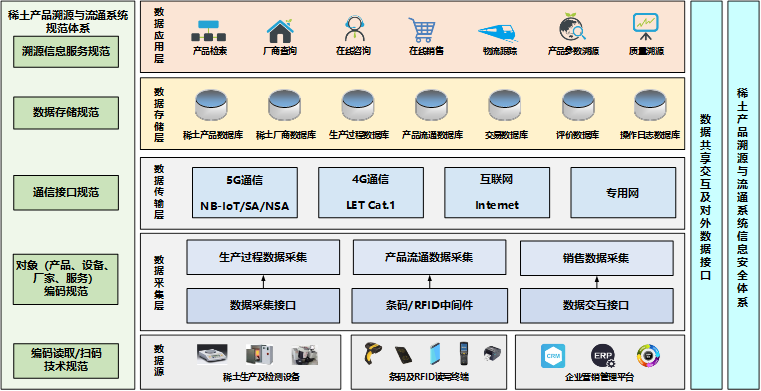

# RETrack需求分析

---

针对产品标识信息碎片化，产品质量数据及关键参数无法共享，物流效率低下等问题，构建离子型稀土产品溯源和流通机制，优化资源配置，提高物流效率，实现产供销一体化。要构建整个溯源系统，首先必须解决规范化问题，即建立全产业链的编码规范、溯源指标体系、质量指标体系等行业标准。此外，需要开发一款可在离子型稀土全产业链各环节使用的，具有较强通用性的溯源处理终端，使用NB-IoT技术实现数据上传到云端服务器

## 服务器层的主要功能

#### 前台

---

##### 在线咨询

##### 物流跟踪

##### 生成仿真数据功能

* 可按一定设置自动产生仿真数据，用以系统测试

##### 数据分析功能

* 可按照厂家、产品、时间等维度，对产品溯源情况进行分析，对溯源访问情况进行分析等。

##### 浏览器自适应功能

* 可适配电脑端和手机端浏览器的查看。

##### 用户功能

* 普通用户
    * 用户注册功能
    * 用户登录功能
    * 用户信息设置
    * 关联厂家功能
    * 用户退出

* 关联厂家用户

    * 添加厂家产品

    * 交易信息查看

    * 厂家信息设置

    * 人员登记

        * 负责人
        * 运输人员

    * 产品信息管理

        * 添加产品

        * 展示所有产品
        * 产品分页
        * 产品查询
        * 修改产品属性
        * 添加产品
        * 删除产品
        * 批量删除产品

##### 溯源流程案例展示

##### 帮助中心功能

* 常见问题专栏
    * 问题解决

##### 稀土产品模块

* 优质产品展示
* 专题产品展示

* 在线溯源功能
    * 能够根据用户输入的产品编码，进行产品全链条溯源，可给出完整的溯源图谱，给出各阶段的主要数据。
    * 能够输入产品的信息，查找相关联的产品

* 相关矿物介绍

* 稀土功能材料制备工艺

    * 稀土功能材料制备技术发展介绍

    * 稀土功能材料制备工艺介绍

##### 企业模块

* 厂家查询
* 厂家信息模块

##### 关于我们模块

* 公司介绍
* 发展历程
* 联系方式

---

#### 后台

---

##### 首页展示

* 产品总览
* 用户总览

##### 用户管理

* 展示所有用户
* 所有用户分页
* 用户按属性查询
* 删除用户
* 修改用户属性
* 批量删除用户
* 增加用户

##### 工厂管理

* 展示所有工厂
* 所有工厂分页
* 工厂按属性查询
* 删除工厂
* 修改工厂属性
* 批量删除工厂
* 增加工厂

##### 产品管理

* 添加产品

* 展示所有产品
* 产品分页
* 产品查询
* 修改产品属性
* 添加产品
* 删除产品
* 批量删除产品

##### 内容管理

* 首页栏目管理
* 帮助管理
* 首页推荐管理
* 常见问题管理
* 产品专题管理
* 优质产品管理
* 最新消息管理

##### 权限管理

- 权限管理：添加权限、删除权限、修改权限、以树形结构返回权限
- 角色管理：添加角色、删除角色、更新角色、角色列表、获取相应角色权限、修改相应角色权限
- 成员管理：添加、编辑、删除成员、成员列表、为成员分配角色、获取成员角色、分配+-权限、获取权限列表

| 角色   | 菜单                         |
| ------ | ---------------------------- |
| 管理员 | 所有菜单权限                 |
| 运营   | 首页、用户、促销、运营、内容 |
| 财务   | 首页、统计、财务             |
| 美工   | 首页                         |
| 客服   | 首页                         |

## 手机APP层的主要功能

##### 产品溯源功能：

通过扫码功能，可对读取产品的生产信息、质量信息等参数或指标。

溯源信息的采用分级显示的设计，对于常规数据，通过扫码可直接从服务器中获取，对于需授权数据，则需要进行身份验证之后，才能显示出来。

（3）可通过网页的方式，而不是专用的APP的方式，实现上述功能。

 